# トランザクション・分散システム設計(Part 2)

## メッセージキューとデータベースの書き込みを同一のトランザクション内で実行する

### 概要

データベースへの書き込みとメッセージキューへの発行を同時に行う場合、両方が成功または両方が失敗することを保証する必要があります。
Outboxパターンを使用して、トランザクショナルメッセージングを実現します。

### システム設計図

```mermaid
graph TB
    subgraph "Outboxパターン"
        App[アプリケーション]
        DB[(データベース)]
        OutboxTable[(Outboxテーブル)]
        Relay[メッセージリレー<br/>CDC/ポーリング]
        MessageQueue[メッセージキュー]
        
        App -->|1. トランザクション開始| DB
        App -->|2. ビジネスデータ書き込み| DB
        App -->|3. Outboxレコード挿入| OutboxTable
        App -->|4. コミット| DB
        
        OutboxTable -->|5. 変更検知| Relay
        Relay -->|6. メッセージ発行| MessageQueue
        Relay -->|7. 発行済みフラグ更新| OutboxTable
    end
    
    subgraph "CDC(Change Data Capture)"
        DBLog[データベースログ<br/>Binlog/WAL]
        Debezium[Debezium<br/>CDC コネクター]
        Kafka[Kafkaトピック]
        
        DBLog --> Debezium
        Debezium --> Kafka
    end
    
    subgraph "ポーリング方式"
        Scheduler[スケジューラー<br/>定期実行]
        SelectOutbox[SELECT * FROM outbox<br/>WHERE published=false]
        Publish[メッセージ発行]
        UpdateOutbox[UPDATE outbox<br/>SET published=true]
        
        Scheduler --> SelectOutbox
        SelectOutbox --> Publish
        Publish --> UpdateOutbox
    end
```

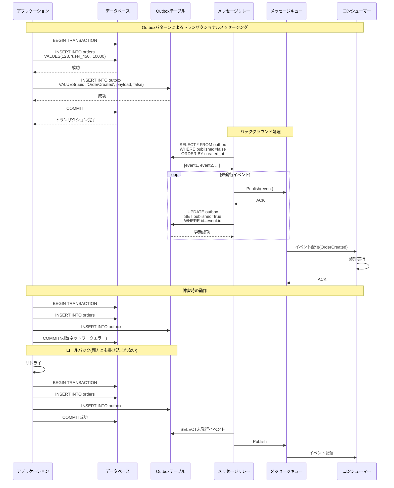

### 設計のポイント

Outboxテーブルとビジネステーブルを同一トランザクションで更新することで、原子性を保証します。
メッセージリレーは、CDCまたはポーリングでOutboxテーブルを監視します。
CDCは低レイテンシですが、データベースの変更ログに依存します。
ポーリングはシンプルですが、レイテンシが高くなります。
メッセージの重複配信を考慮して、コンシューマー側で冪等性を保証します。
Outboxテーブルの古いレコードは定期的に削除します。

## API Gatewayでマイクロサービスの入口を作る

### 概要

API Gatewayは、クライアントとマイクロサービス群の間に配置され、ルーティング、認証、レート制限、ロギングなどを一元管理します。
バックエンドサービスの複雑さをクライアントから隠蔽します。

### システム設計図

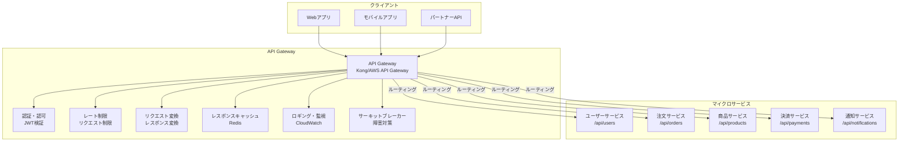

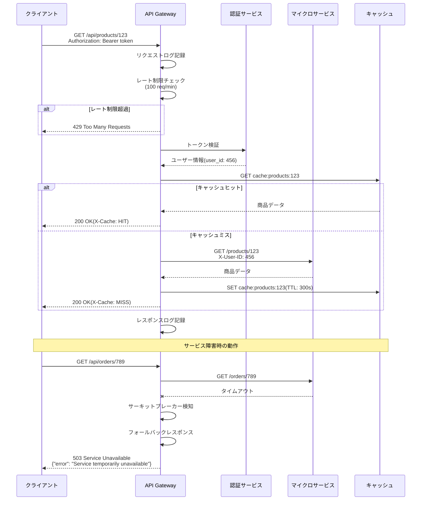

### 設計のポイント

API Gatewayは水平スケールして、単一障害点にならないようにします。
認証トークンの検証をGatewayで行い、バックエンドサービスの負荷を軽減します。
GraphQL Gatewayを使用することで、複数のマイクロサービスからデータを集約できます。
BFF(Backend for Frontend)パターンを適用して、クライアントごとに最適化されたAPIを提供します。
API GatewayとService Meshを組み合わせることで、包括的な制御を実現します。

## Service Meshによるサービス間通信の管理

### 概要

Service Meshは、マイクロサービス間の通信を管理するインフラレイヤーです。
サイドカープロキシを使用して、トラフィック管理、セキュリティ、オブザーバビリティを提供します。

### システム設計図

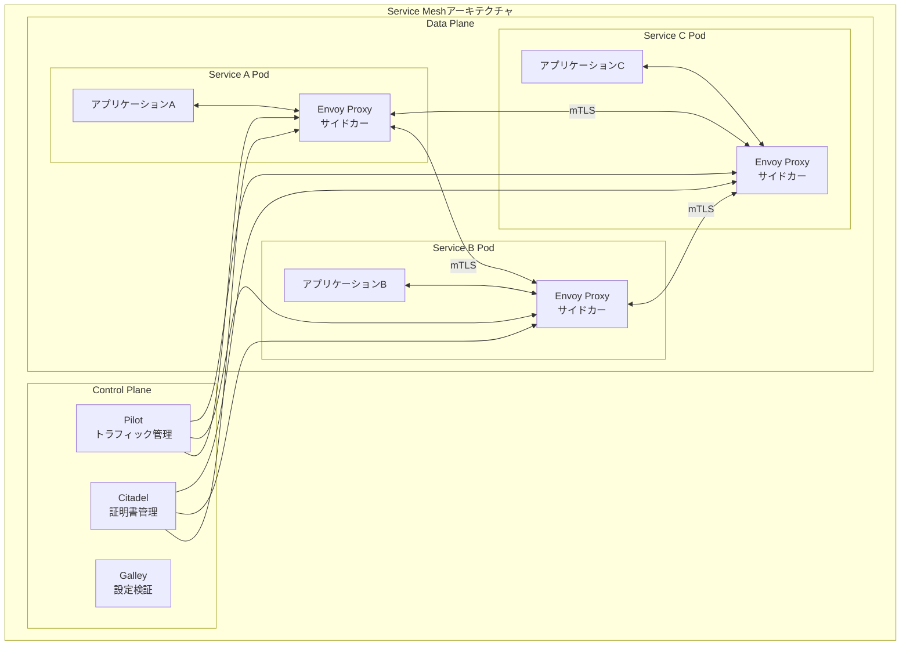

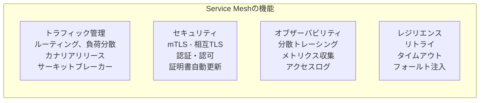

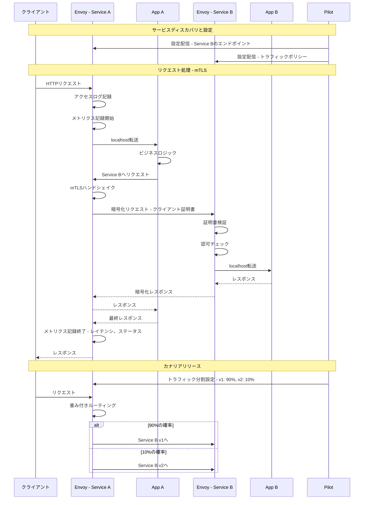

### 設計のポイント

Istio、Linkerd、Consul Connectなどが代表的なService Mesh実装です。
サイドカープロキシは、アプリケーションコードを変更せずに機能を追加できます。
mTLSにより、サービス間通信を自動的に暗号化し、ゼロトラストセキュリティを実現します。
Control Planeは、ポリシーの一元管理と設定の配信を担当します。
オブザーバビリティ機能により、分散トレーシング(Jaeger、Zipkin)やメトリクス(Prometheus)と連携します。
カナリアリリースやA/Bテストをインフラレベルで実現できます。

## コーディネーションサービスを活用した分散システムの管理

### 概要

ZooKeeperやetcdなどのコーディネーションサービスを使用して、分散システムの設定管理、サービスディスカバリ、リーダー選出を行います。
強整合性を保ちながら、複数のノード間で情報を共有します。

### システム設計図

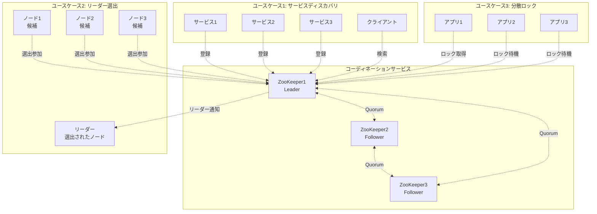

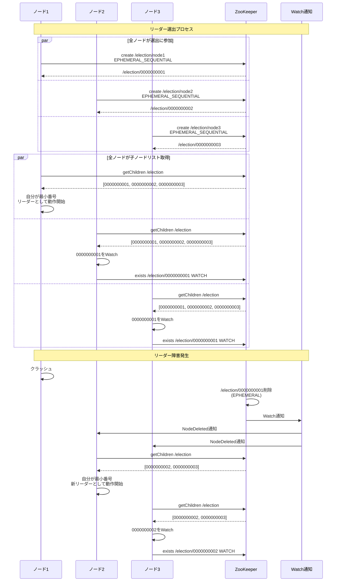

### 設計のポイント

ZooKeeperは、ZAB(ZooKeeper Atomic Broadcast)プロトコルにより、強整合性を保証します。
Ephemeralノードを使用することで、クライアントのセッション切断時に自動的にノードが削除されます。
Watchメカニズムにより、データ変更を即座に検知できます。
Quorumベースの動作により、過半数のノードが生存していれば動作し続けます。
リーダー選出は、シーケンシャルノードの番号で判定し、公平性を保ちます。

## 分散合意アルゴリズム(Paxos, Raft)

### 概要

分散システムにおいて、複数のノード間で一貫した状態を維持するために合意アルゴリズムが必要です。
Paxos と Raft は代表的な合意アルゴリズムで、ネットワーク分断や障害が発生しても正しく動作します。

### システム設計図

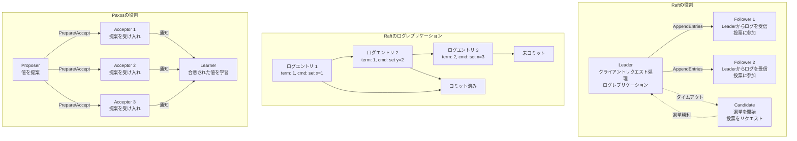

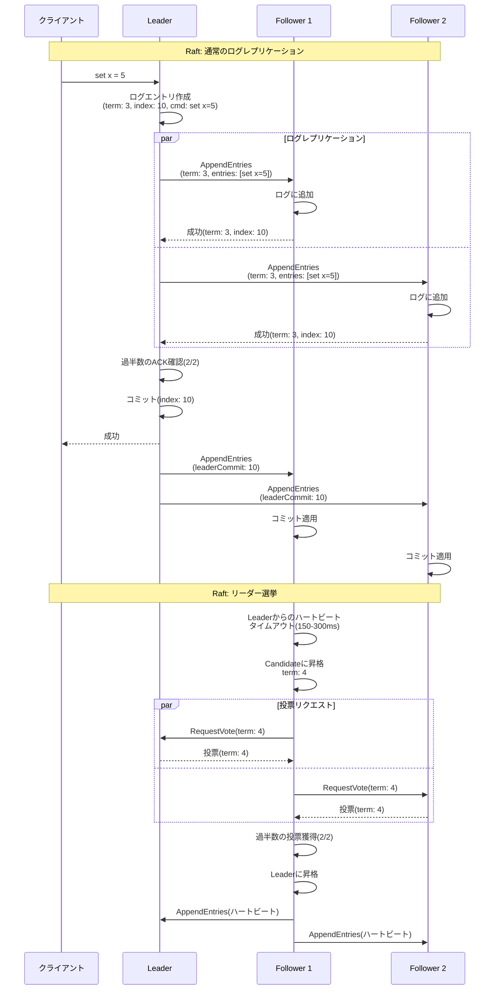

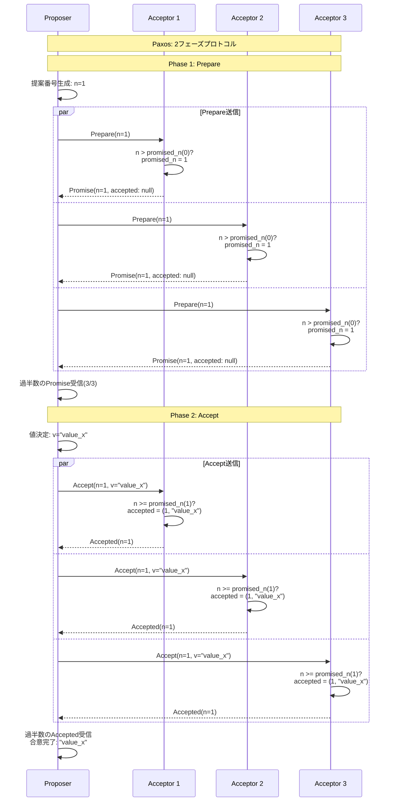

### 設計のポイント

Raftは、Paxosより理解しやすく実装しやすいため、etcdやConsulなど多くのシステムで採用されています。
Paxosは、より一般的で柔軟ですが、実装が複雑で、Multi-Paxosなどの拡張が必要です。
両アルゴリズムとも、過半数(Quorum)のノードの合意が必要で、f台の障害に耐えるには2f+1台のノードが必要です。
Raftでは、リーダー選挙のタイムアウトをランダム化することで、スプリットブレインを防ぎます。
ログの圧縮(スナップショット)を定期的に行い、ログの肥大化を防ぎます。
ネットワーク分断時は、過半数を持つパーティションのみが処理を継続できます。

## 分散システムでユニークIDを設計する

### 概要

分散システムでは、複数のサーバーで同時にIDを生成する必要があります。
Snowflake、UUID、データベースシーケンス、Redisカウンターなど、様々な手法を理解し、要件に応じて選択します。

### システム設計図

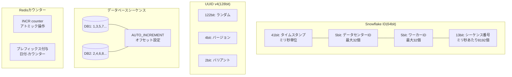

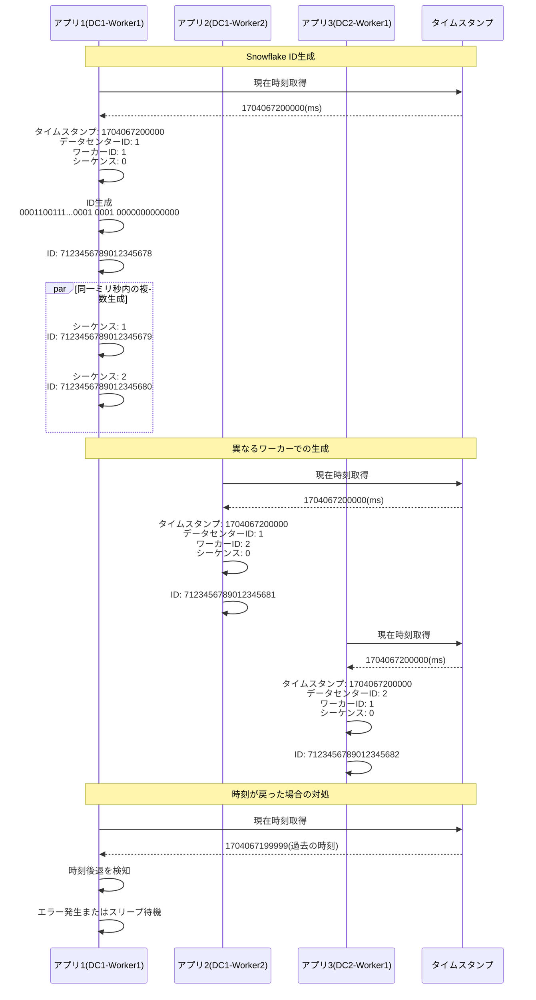

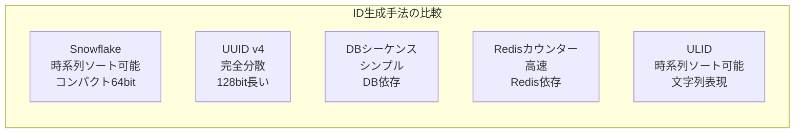

### 設計のポイント

Snowflake IDは、時系列でソート可能で、64bitとコンパクトです。
UUIDは、完全に分散して生成できますが、128bitと長く、ランダムなためインデックス効率が悪いです。
データベースシーケンスは、シンプルですが、データベースがボトルネックになります。
Redisカウンターは、高速ですが、Redisへの依存とネットワークレイテンシが課題です。
時刻同期の問題を考慮し、NTPで時刻を正確に保ちます。
ワーカーIDの管理は、環境変数や設定ファイルで行います。
